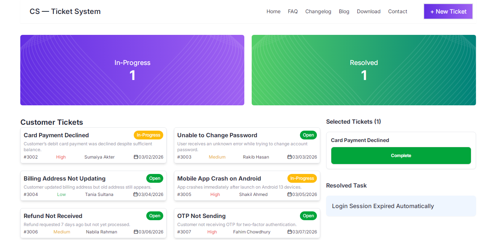

# 🎫 Customer Support Zone - Ticket System

Customer Support Zone is a simple and responsive **Customer Ticket Management System**.
It helps support teams track customer issues, monitor progress, and mark tasks as resolved efficiently.

---

## 🚀 Live Preview

🔗 Live Site: https:[//your-live-link.com](https://mominulislam1234423.github.io/Customer-Support-Zone/)

---

## Screenshot


---

## ✨ Key Features

* 📌 View customer support tickets in a dashboard
* 🟢 Ticket status management (Open / In-Progress / Resolved)
* 📊 Real-time ticket progress display
* 🧾 Detailed ticket information with customer name and issue description
* 🎨 Clean and modern UI design
* 📱 Responsive layout for desktop, tablet, and mobile
* ➕ New Ticket button for creating support requests

---

## 🛠️ Technologies Used

* HTML5
* CSS3
* Tailwind CSS
* Daisy UI
* JavaScript

---

## 📂 Project Structure

```
Customer-Support-Zone
│
├── index.html
├── css
│   └── style.css
├── js
│   └── script.js
├── assets
│   └── images
└── README.md
```

---

## 🎯 Project Goal

The purpose of this project is to practice building a **Customer Support Ticket Dashboard** where users can manage customer issues and track the progress of support tasks.

---


## Answer to the questions:
1) What is JSX, and why is it used?
-  JSX (JavaScript XML) হলো JavaScript এর একটি syntax যা React এ HTML এর মতো করে UI লিখতে ব্যবহার করা হয়। এটি কোডকে সহজ করে।

2) What is the difference between State and Props?
-  Props parent component থেকে data পাঠায় এবং read-only।
- State component এর নিজের data যা change করা যায়।

3) What is the useState hook, and how does it work?
-  useState React এর একটি hook যা functional component এ state manage করতে ব্যবহার হয়। এটি state value এবং state update করার function দেয়।

4) How can you share state between components in React?
-  Parent component এ state রেখে props এর মাধ্যমে child component এ পাঠিয়ে state share করা হয়।

5) How is event handling done in React?
- React এ event handling function দিয়ে করা হয় এবং event name camelCase হয়, যেমন onClick।

---

## 👨‍💻 Author

**Mominul**

https://github.com/Mominulislam1234423
---

⭐ If you like this project, give it a **star ⭐ on GitHub**.
